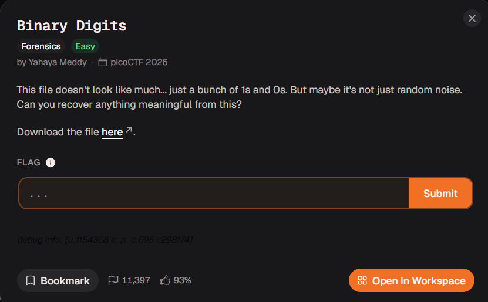
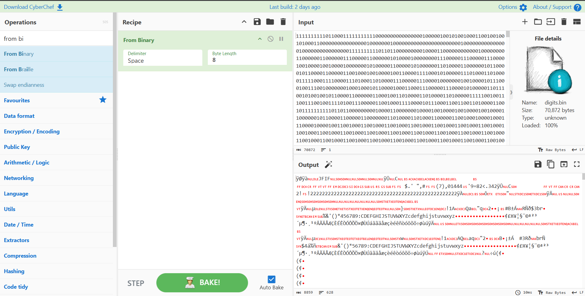
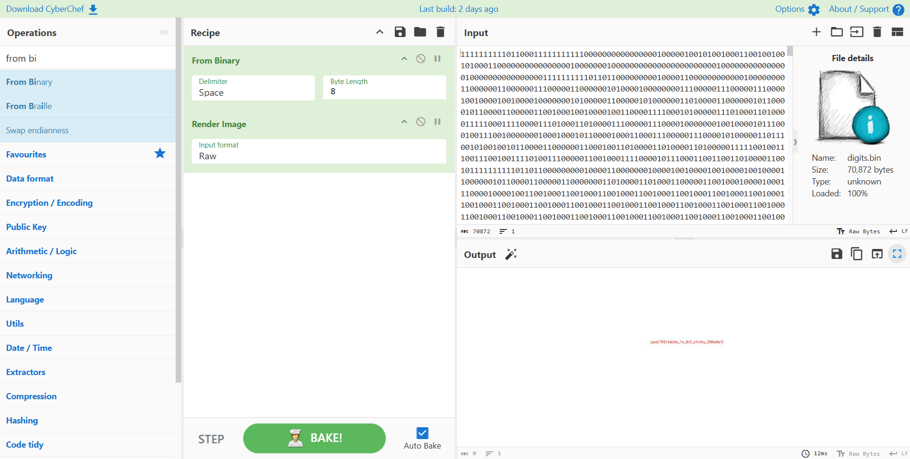

# Binary Digits

## Challenge Information

- **Platform:** CyLabs
- **Event:** picoCTF 2026
- **Category:** Forensics
- **Difficulty:** Easy

## Description

This file doesn't look like much... just a bunch of 1s and 0s.
But maybe it's not just random noise.

## Tools Used

- CyberChef

## Solution

I used CyberChef's `From Binary` operation with a byte length of 8.

## Flag

Flag captured successfully. 🚩